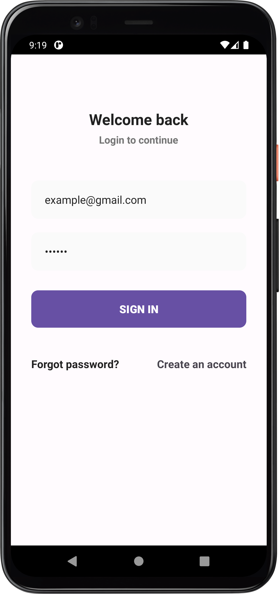
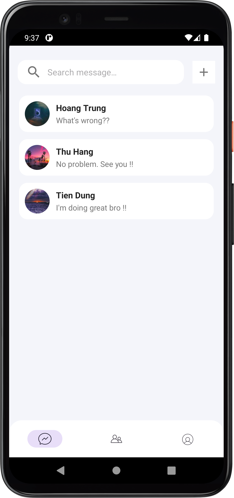
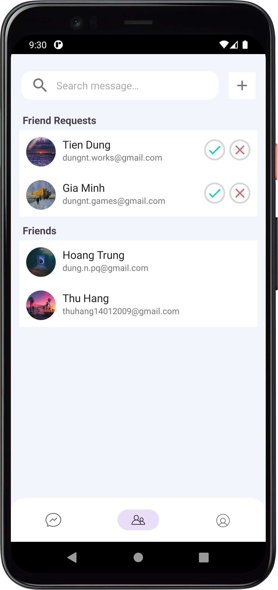
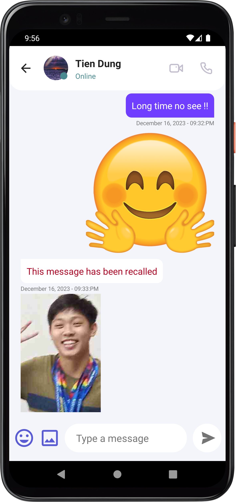
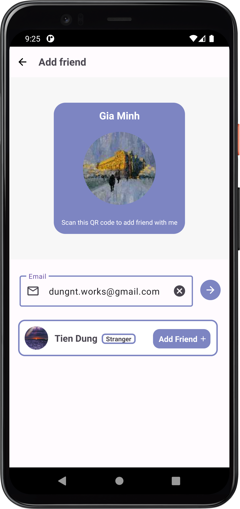
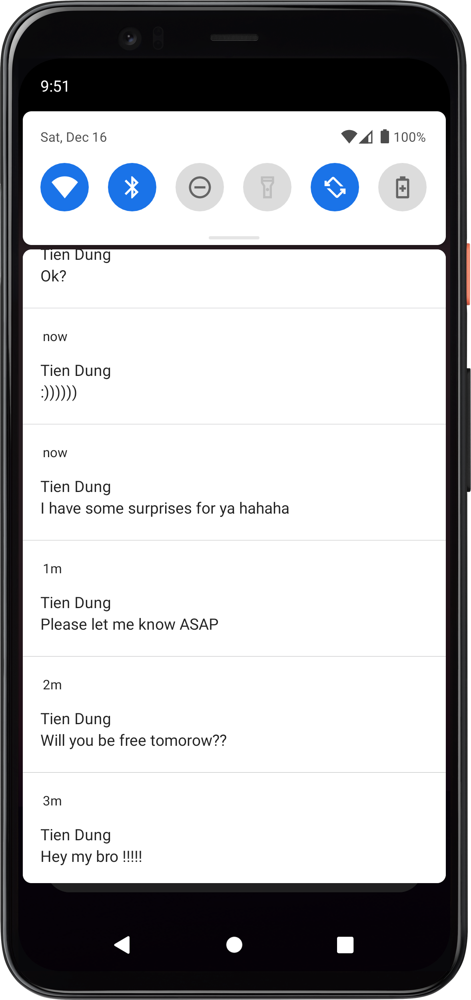

# Chat
Android Real-time Chat Application

## App features
- Real-time message (text, image, sticker) with recall feature
- Real-time friend system
- Email-based login and registration
- Push notification for new messages
- Account management

## Supported languages
- English 

## Screenshots
  
  
   

## Technical information
- Database: Firebase Firestore
- Account management: Firebase Authentication
- Push notification: Firebase Cloud Messaging
- Image and sticker storage: Firebase Storage
- Permissions:
  * Internet
  * Push notifications
  * Read media images (API 33+)
  * Read external storage (API 32-)
- MinSdk: 21
- TargetSdk: 33

## Authors
- [@ngtienndungg](https://github.com/ngtienndungg)
